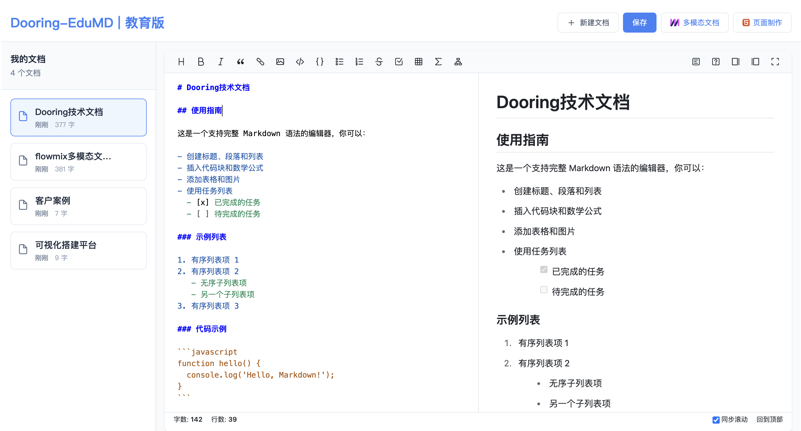

# ✨ md-editor - 一款开箱即用的md编辑器

**让创作回归纯粹，同时拥有专业级力量**  
一款专为开发者和文字工作者设计的开源Markdown编辑器，融合极简界面与强大功能。



### 🌐 跨平台同步
- **云端存档**：自动保存至 GitHub Gist/Dropbox
- **PWA 支持**：无需安装，浏览器即用

## 🛠️ 快速开始

### 安装方式
```bash
# npm
npm install

# yarn
yarn

# pnpm
pnpm install
```

或直接下载：[最新发行版](https://github.com/MrXujiang/md-editor/archive/refs/heads/main.zip)

### 基础使用
1. 创建新文档 `Cmd/Ctrl + N`
2. 输入 `# 标题` 开始创作
3. 按 `Cmd/Ctrl + P` 切换预览模式

## 🧑💻 开发者指南

### 技术栈
- **核心框架**: React + Typescript
- **编辑器引擎**: ByteMd
- **样式系统**: Less + CSS Module

### 本地构建
```bash
git clone git@github.com:MrXujiang/md-editor.git
cd md-editor
npm install
npm run dev
```

## 🤝 加入创新者行列
我们欢迎各种形式的贡献：
- 🐛 [报告问题](https://github.com/MrXujiang/md-editor/issues)
- 💡 [提交功能建议](https://github.com/MrXujiang/md-editor/discussions)
- ✨ [发起PR](https://github.com/MrXujiang/md-editor/pulls)


## 📜 开源协议
本项目采用 [MIT License](LICENSE) 授权

### 更多优质项目

| 项目名称                                                  | 应用场景        |
|-------------------------------------------------------|-------------|
| [H5-Dooring](https://github.com/MrXujiang/h5-Dooring) | 可视化零代码搭建    |
| [flowmix/docx](https://flowmix.turntip.cn)            | 下一代多模态文档编辑器 |
| [橙子轻文档](https://orange.turntip.cn/doc)                | 文档项目管理平台    |
